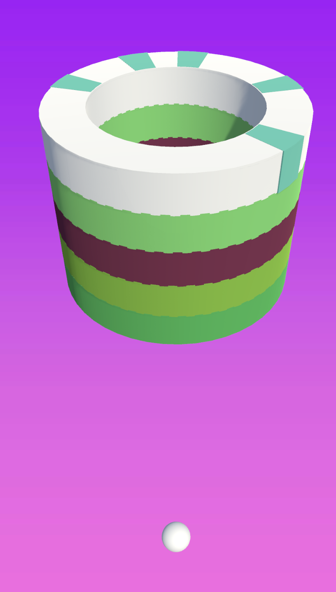

# Paint-Hit-Clone

## Project Overview
Paint-Hit-Clone is a Unity-based game where players throw balls to paint objects while avoiding obstacles. The game features:
- Rotating circles with segments to hit and paint.
- Increasing difficulty as players progress through levels.
- Interactive visuals and dynamic gameplay mechanics.

---

## Features

### Core Mechanics
- **Ball Throwing**: Players hit circles to paint segments.
- **Obstacle Avoidance**: Specific segments act as obstacles that players must avoid.
- **Level Progression**: Difficulty increases with more obstacles and faster rotations in higher levels.

### Visual Elements
- Dynamic color changes managed by `ColorScript`.
- Particle effects for successful hits and failures.
- Interactive UI for score tracking, hearts, and level progression.

---

## Project Structure

### Scripts
1. **Ball.cs**
   - Manages ball throwing, collisions, and interactions with game objects.
   - Tracks remaining balls and updates UI.

2. **ChangeColor.cs**
   - Handles the color-changing logic when a ball hits a target segment.
   - Spawns splash effects for visual feedback.

3. **ColorScripts.cs**
   - Defines color sets for the game.
   - Dynamically assigns colors to game objects based on player progress.

4. **LevelsManager.cs**
   - Handles level progression and difficulty scaling.
   - Defines the number of balls and circles for each level.
   - Introduces hurdles and obstacles dynamically.

---

## How to Use

### Prerequisites
- Unity Editor 2021 or later.
- Basic knowledge of Unity's GameObject system and prefabs.

### Setup
1. Clone or download this repository.
2. Open the project in Unity.
3. Ensure all assets (e.g., `Round` prefabs, color arrays, and effects) are correctly assigned in the inspector.

### Running the Game
1. Press the Play button in Unity Editor.
2. Use the mouse or touch input to throw balls.
3. Progress through levels by painting all segments while avoiding obstacles.

---

## Dependencies
- **Unity iTween**: Used for smooth animations.
- **UnityEngine.UI**: Handles user interface elements.

